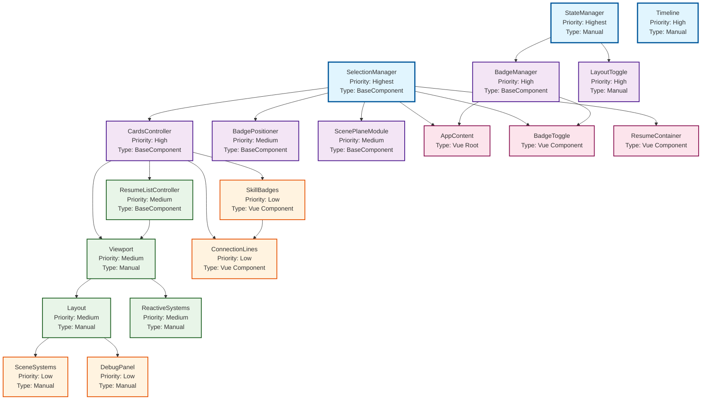
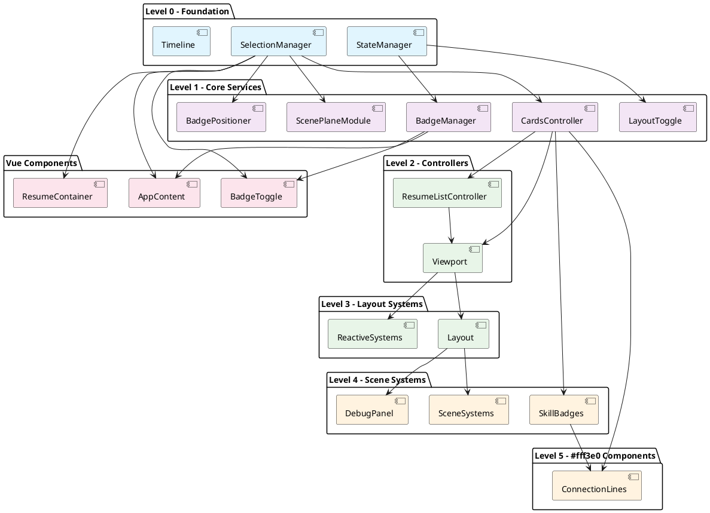
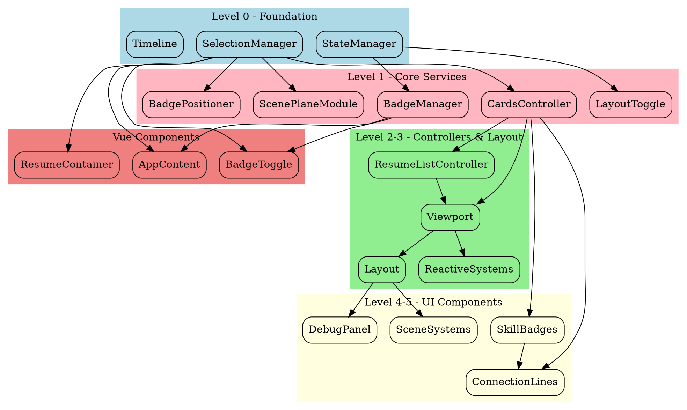

# Resume-Flock Dependency Graph

## Mermaid Diagram Code

```mermaid
graph TD
    %% Level 0 - Foundation (No Dependencies)
    SM[SelectionManager<br/>Priority: Highest<br/>Type: BaseComponent]
    ST[StateManager<br/>Priority: Highest<br/>Type: Manual]
    TL[Timeline<br/>Priority: High<br/>Type: Manual]
    
    %% Level 1 - Core Services
    BM[BadgeManager<br/>Priority: High<br/>Type: BaseComponent]
    LT[LayoutToggle<br/>Priority: High<br/>Type: Manual]
    CC[CardsController<br/>Priority: High<br/>Type: BaseComponent]
    BP[BadgePositioner<br/>Priority: Medium<br/>Type: BaseComponent]
    SPM[ScenePlaneModule<br/>Priority: Medium<br/>Type: BaseComponent]
    
    %% Level 2 - Controllers
    RLC[ResumeListController<br/>Priority: Medium<br/>Type: BaseComponent]
    VP[Viewport<br/>Priority: Medium<br/>Type: Manual]
    
    %% Level 3 - Layout Systems
    LAY[Layout<br/>Priority: Medium<br/>Type: Manual]
    RS[ReactiveSystems<br/>Priority: Medium<br/>Type: Manual]
    
    %% Level 4 - Scene Systems
    SS[SceneSystems<br/>Priority: Low<br/>Type: Manual]
    SB[SkillBadges<br/>Priority: Low<br/>Type: Vue Component]
    DP[DebugPanel<br/>Priority: Low<br/>Type: Manual]
    
    %% Level 5 - UI Components
    CL[ConnectionLines<br/>Priority: Low<br/>Type: Vue Component]
    
    %% Vue Components (separate cluster)
    AC[AppContent<br/>Type: Vue Root]
    BT[BadgeToggle<br/>Type: Vue Component]
    RC[ResumeContainer<br/>Type: Vue Component]
    
    %% Dependencies
    ST --> BM
    ST --> LT
    SM --> CC
    SM --> BP
    SM --> SPM
    SM --> AC
    SM --> BT
    SM --> RC
    
    CC --> RLC
    CC --> VP
    CC --> SB
    CC --> CL
    
    RLC --> VP
    VP --> LAY
    VP --> RS
    
    LAY --> SS
    LAY --> DP
    
    SB --> CL
    
    BM --> AC
    BM --> BT
    
    %% Styling
    classDef foundation fill:#e1f5fe,stroke:#01579b,stroke-width:3px
    classDef service fill:#f3e5f5,stroke:#4a148c,stroke-width:2px
    classDef controller fill:#e8f5e8,stroke:#1b5e20,stroke-width:2px
    classDef ui fill:#fff3e0,stroke:#e65100,stroke-width:2px
    classDef vue fill:#fce4ec,stroke:#880e4f,stroke-width:2px
    
    class SM,ST,TL foundation
    class BM,LT,CC,BP,SPM service
    class RLC,VP,LAY,RS controller
    class SS,SB,DP,CL ui
    class AC,BT,RC vue
```

## PlantUML Alternative

```plantuml
@startuml ResumeFlock-Dependencies

!define FOUNDATION #e1f5fe
!define SERVICE #f3e5f5
!define CONTROLLER #e8f5e8
!define UI #fff3e0
!define VUE #fce4ec

package "Level 0 - Foundation" as L0 {
    [SelectionManager] FOUNDATION
    [StateManager] FOUNDATION
    [Timeline] FOUNDATION
}

package "Level 1 - Core Services" as L1 {
    [BadgeManager] SERVICE
    [LayoutToggle] SERVICE
    [CardsController] SERVICE
    [BadgePositioner] SERVICE
    [ScenePlaneModule] SERVICE
}

package "Level 2 - Controllers" as L2 {
    [ResumeListController] CONTROLLER
    [Viewport] CONTROLLER
}

package "Level 3 - Layout Systems" as L3 {
    [Layout] CONTROLLER
    [ReactiveSystems] CONTROLLER
}

package "Level 4 - Scene Systems" as L4 {
    [SceneSystems] UI
    [SkillBadges] UI
    [DebugPanel] UI
}

package "Level 5 - UI Components" as L5 {
    [ConnectionLines] UI
}

package "Vue Components" as Vue {
    [AppContent] VUE
    [BadgeToggle] VUE
    [ResumeContainer] VUE
}

' Dependencies
StateManager --> BadgeManager
StateManager --> LayoutToggle
SelectionManager --> CardsController
SelectionManager --> BadgePositioner
SelectionManager --> ScenePlaneModule
SelectionManager --> AppContent
SelectionManager --> BadgeToggle
SelectionManager --> ResumeContainer

CardsController --> ResumeListController
CardsController --> Viewport
CardsController --> SkillBadges
CardsController --> ConnectionLines

ResumeListController --> Viewport
Viewport --> Layout
Viewport --> ReactiveSystems

Layout --> SceneSystems
Layout --> DebugPanel

SkillBadges --> ConnectionLines

BadgeManager --> AppContent
BadgeManager --> BadgeToggle

@enduml
```

## Graphviz DOT Format

```dot
digraph ResumeFlock {
    rankdir=TB;
    node [shape=box, style=rounded];
    
    // Styling
    subgraph cluster_0 {
        label="Level 0 - Foundation";
        style=filled;
        color=lightblue;
        SelectionManager [fillcolor="#e1f5fe"];
        StateManager [fillcolor="#e1f5fe"];
        Timeline [fillcolor="#e1f5fe"];
    }
    
    subgraph cluster_1 {
        label="Level 1 - Core Services";
        style=filled;
        color=lightpink;
        BadgeManager [fillcolor="#f3e5f5"];
        LayoutToggle [fillcolor="#f3e5f5"];
        CardsController [fillcolor="#f3e5f5"];
        BadgePositioner [fillcolor="#f3e5f5"];
        ScenePlaneModule [fillcolor="#f3e5f5"];
    }
    
    subgraph cluster_2 {
        label="Level 2-3 - Controllers & Layout";
        style=filled;
        color=lightgreen;
        ResumeListController [fillcolor="#e8f5e8"];
        Viewport [fillcolor="#e8f5e8"];
        Layout [fillcolor="#e8f5e8"];
        ReactiveSystems [fillcolor="#e8f5e8"];
    }
    
    subgraph cluster_3 {
        label="Level 4-5 - UI Components";
        style=filled;
        color=lightyellow;
        SceneSystems [fillcolor="#fff3e0"];
        SkillBadges [fillcolor="#fff3e0"];
        DebugPanel [fillcolor="#fff3e0"];
        ConnectionLines [fillcolor="#fff3e0"];
    }
    
    subgraph cluster_vue {
        label="Vue Components";
        style=filled;
        color=lightcoral;
        AppContent [fillcolor="#fce4ec"];
        BadgeToggle [fillcolor="#fce4ec"];
        ResumeContainer [fillcolor="#fce4ec"];
    }
    
    // Dependencies
    StateManager -> BadgeManager;
    StateManager -> LayoutToggle;
    SelectionManager -> CardsController;
    SelectionManager -> BadgePositioner;
    SelectionManager -> ScenePlaneModule;
    SelectionManager -> AppContent;
    SelectionManager -> BadgeToggle;
    SelectionManager -> ResumeContainer;
    
    CardsController -> ResumeListController;
    CardsController -> Viewport;
    CardsController -> SkillBadges;
    CardsController -> ConnectionLines;
    
    ResumeListController -> Viewport;
    Viewport -> Layout;
    Viewport -> ReactiveSystems;
    
    Layout -> SceneSystems;
    Layout -> DebugPanel;
    
    SkillBadges -> ConnectionLines;
    
    BadgeManager -> AppContent;
    BadgeManager -> BadgeToggle;
}
```